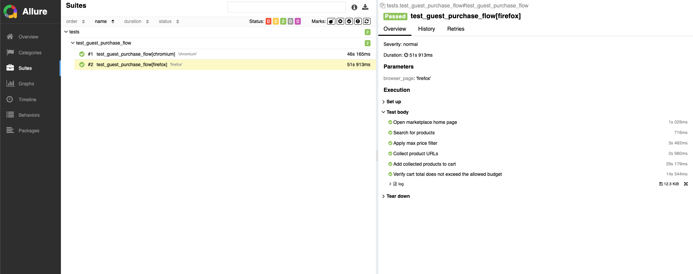

# eBay Playwright Automation Framework
End-to-end automation framework for an eBay purchase flow built with **Playwright + Python**.
The framework demonstrates a scalable test architecture including **Page Object Model, retry mechanisms, smart locators, and structured logging**.
---

# Features
• Page Object Model (POM) architecture.
• Data-driven test inputs from YAML.
• Retry helper and smart locator fallback for flaky UI conditions.
• Structured logging.
• Cross-browser execution.
• Allure reporting integration.
• Artifacts on run: logs, traces, videos, and failure screenshots.

---
### Layers
**Tests**
- Test scenarios
- High-level test definitions

**Flows**
- Business flows
- Combine multiple page operations

**Pages**
- Page Object Model implementation
- Encapsulate UI interactions

**Utils**
- Reusable infrastructure utilities
- Retry mechanisms
- Logging
- Price parsing

---
# Project Structure
ebay-playwright-automation

src/
pages/
home_page.py
search_results_page.py
product_page.py
cart_page.py

flows/
purchase_flows.py

utils/
retry_helper.py
logger.py
price_parser.py

tests/
test_guest_purchase_flow.py

---

# Implemented Flow
Guest purchase scenario:
1. Open eBay home page
2. Search for a product
3. Apply max price filter
4. Collect product URLs under price limit
5. Add items to cart
6. Validate cart total does not exceed budget

---

# Smart Locator Strategy
To increase test stability:
• Multiple locator strategies are defined for important elements  
• Fallback locators are used if the primary locator fails  
• Locator logic is abstracted in page classes

---

# Retry & Resilience Strategy
The framework includes a retry mechanism to handle unstable UI and network delays.
Retry is applied to critical operations such as:
- Navigation
- Element interaction
- Data extraction
This improves robustness against transient failures.

---

# Reporting
Test execution generates:
• Allure reports  
• Screenshots on failure  
• Execution logs

## Prerequisites
- Python 3.14 is the version currently documented for this project.
- `pip`
- Playwright browser binaries (installed in setup step)
- Optional: Allure CLI (only if you want to open Allure reports)

## Setup

```bash
python3 -m venv .venv
source .venv/bin/activate
pip install -r requirements.txt
playwright install
```

Optional: install the Allure CLI if you want to open HTML reports locally.
The Python Allure packages used by Pytest are already installed from `requirements.txt`.

On macOS with Homebrew:
```bash
brew install allure
allure --version
```

If you are not using macOS or Homebrew, install the CLI from the official Allure docs:
https://allurereport.org/docs/install/

## Run tests
By default, the `browser_page` fixture runs tests in `chromium` and `firefox`.
Basic run:
```bash
pytest
```

Run in headed mode:
```bash
pytest --headless=false
```

Parallel run with `pytest-xdist`:

```bash
pytest -n auto
```

Run with Allure results output:
```bash
RESULT_DIR="allure-results-run_$(date +%Y%m%d_%H%M%S)"
pytest --alluredir="$RESULT_DIR"
allure serve "$RESULT_DIR"
```

## Test data
Edit `src/data/test_data.yaml` to control runtime values:
- `base_url`
- `cart_url`
- `query`
- `max_price`
- `limit`
- `timeout_ms`

## Project layout
- `tests/test_guest_purchase_flow.py`: end-to-end guest purchase scenario.
- `src/flows/purchase_flow.py`: reusable flow steps for search, filter, collect, cart add, and cart validation.
- `src/pages/`: page objects (`home_page`, `search_results_page`, `product_page`, `cart_page`).
- `src/utils/`: logger, retry helper, smart locator, and price parser.
- `conftest.py`: fixtures, browser setup, tracing/video/screenshot artifact handling.
- `pytest.ini`: Pytest defaults and test discovery path.

## Artifacts
Test artifacts are written under `artifacts/`:
- `artifacts/logs/test_run.log`
- `artifacts/traces/*.zip`
- `artifacts/videos/`
- `artifacts/screenshots/*.png` (on failure)

## Assumptions and limitations
- Tests run as guest (no login flow).
- eBay anti-bot protections/CAPTCHA may block automation in some environments.
- The project does not attempt to bypass security protections.

## Commands:
- pytest -n auto --alluredir=allure-results-run_$(date +%Y%m%d_%H%M%S)
- allure serve allure-results-run_$(date +%Y%m%d_%H%M%S)

### Example Report
